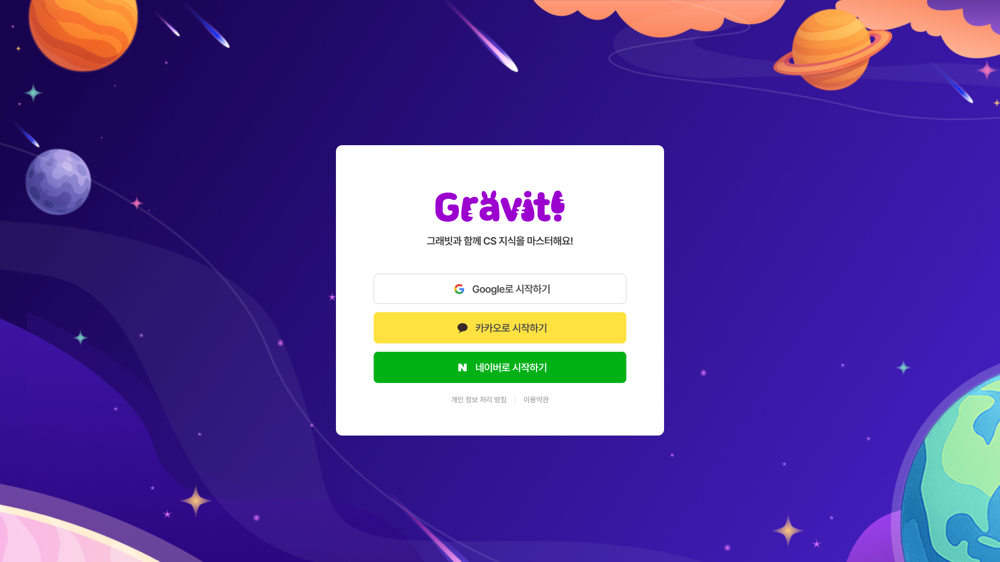
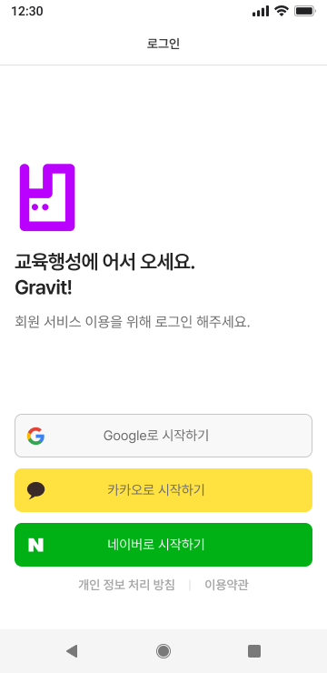

# ACC-01 로그인

## 1. 화면 개요

| 항목      | 내용                                                                |
| --------- | ------------------------------------------------------------------- |
| 화면 ID   | ACC-01                                                              |
| 화면명    | 로그인                                                              |
| 형태      | 라우트 화면. 넓은 화면은 우주 배경 위의 카드, 좁은 화면은 전체 화면 |
| 경로      | `/`                                                                 |
| 진입 화면 | 앱 첫 진입 · 로그아웃 후 · 401 응답 후 세션 정리                    |
| 다음 화면 | 각 provider의 외부 인가 페이지 → `/login/oauth2/code/:provider`     |

소셜 로그인 제공자를 골라 Gravit에 로그인한다. 이미 로그인한 사용자는 이 화면을 보지 않고
`/main`으로 이동한다.

> 넓은 화면(`min-width: 768px`)과 좁은 화면은 배경·구조·문구가 서로 다른 별개 시안이다.
> 이 문서는 두 시안을 한 화면으로 다루고, 차이가 있는 곳마다 어느 쪽인지 밝힌다.

## 2. 근거 자료

- 최신 기능 명세 기준일: 2026년 9월 9일 (Figma Dev Mode 확인분)
- Figma 화면:
  - [ACC-01-WEB.png](./ACC-01-WEB.png) — `ACC-01-WEB` `13750:65507` (1920×1080)
  - [ACC-01-MOB.png](./ACC-01-MOB.png) — `ACC-01-MOB` `13750:50748` (360×740)
  - 파일 `hu4c6qCEMB62qHXk2v8Gsl` · 페이지 `Screen Design` · 섹션 `SCREEN` › `ACC`
- 라우트:
  - [`index.tsx`](../../../apps/web/src/app/routes/index.tsx) — `/`
  - [`login.oauth2.code.$provider.tsx`](../../../apps/web/src/app/routes/login.oauth2.code.$provider.tsx) — 콜백
  - [`privacy.tsx`](../../../apps/web/src/app/routes/privacy.tsx) · [`terms.tsx`](../../../apps/web/src/app/routes/terms.tsx) — 링크 목적지
- 생성 API 근거:
  - [`oauth2-0-api.ts`](../../../apps/web/src/shared/api/generated/oauth2-0-api/oauth2-0-api.ts) — `authorizeUrl` (`GET /api/v1/oauth/login-url/{provider}`)

> 기획에서 전달된 기능 명세 표가 없는 화면이다. §3의 기능 ID는 이 문서에서 부여했고,
> 내용의 출처는 Figma 시안과 `MIG-018`의 확정 명세다.

## 3. 기능 명세

| 구분   | 기능 ID    | 기능명                | 설명                                                                                          | 참고                | 우선순위 | 상태   | 완료 | 제외 | 수정일          |
| ------ | ---------- | --------------------- | --------------------------------------------------------------------------------------------- | ------------------- | -------- | ------ | ---- | ---- | --------------- |
| 비회원 | ACC-01-F01 | 로그인 사용자 재진입  | • 세션에 accessToken이 있으면 화면을 그리지 않고 `/main`으로 이동                             | 라우트 `beforeLoad` | P0       | 완료   | ☑   | ☐    | 2026년 9월 10일 |
| 비회원 | ACC-01-F02 | 소셜 로그인 버튼      | • Google → 카카오 → 네이버 순서로 3개<br>• 좌측에 provider 로고, 문구는 `{제공자}로 시작하기` |                     | P0       | 완료   | ☑   | ☐    | 2026년 9월 10일 |
| 비회원 | ACC-01-F03 | 인가 페이지 이동      | • 버튼을 누르면 해당 provider의 인가 URL을 조회해 그 주소로 이동                              |                     | P0       | 완료   | ☑   | ☐    | 2026년 9월 10일 |
| 비회원 | ACC-01-F04 | 약관·개인정보 링크    | • `개인정보 처리방침` → `/privacy`<br>• `이용약관` → `/terms`                                 | 시안에만 있음       | P0       | 완료   | ☑   | ☐    | 2026년 9월 10일 |
| 비회원 | ACC-01-F05 | 화면 폭에 따른 구성   | • `min-width: 768px` 이면 우주 배경 + 워드마크 카드<br>• 미만이면 `로그인` 상단바 + 심볼      |                     | P0       | 완료   | ☑   | ☐    | 2026년 9월 10일 |
| 비회원 | ACC-01-F06 | 인가 URL 조회 중 표시 | • 조회 중 해당 버튼을 비활성하고 스피너를 표시한다<br>• 연타해도 요청은 1건만 나간다          | `FIX-019`           | P2       | 완료   | ☑   | ☐    | 2026년 9월 10일 |
| 비회원 | ACC-01-F07 | 로그인 실패 알림      | • 인가 URL 조회 실패 시 사용자에게 알리지 않는다                                              | `FEAT-017`로 분리   | P2       | 미착수 | ☐    | ☐    | 2026년 9월 10일 |

## 4. 라우트 및 화면 이동

| 사용자 동작                    | 이동 경로                      | 화면              |
| ------------------------------ | ------------------------------ | ----------------- |
| accessToken 없이 `/` 진입      | (이동 없음)                    | ACC-01            |
| accessToken 있는 채로 `/` 진입 | `/main`                        | M.1               |
| 소셜 로그인 버튼 클릭          | provider의 외부 인가 페이지    | (외부)            |
| 인가 완료 후 서버 리다이렉트   | `/login/oauth2/code/:provider` | 콜백 (시안 없음)  |
| `개인정보 처리방침` 클릭       | `/privacy`                     | 개인정보 처리방침 |
| `이용약관` 클릭                | `/terms`                       | 이용약관          |

```text
/  (ACC-01 로그인)
  ├─ accessToken 있음 → /main                          (화면을 그리지 않는다)
  ├─ 소셜 버튼 → 외부 인가 페이지 → /login/oauth2/code/:provider
  ├─ 개인정보 처리방침 → /privacy
  └─ 이용약관 → /terms
```

## 5. 화면 사용 데이터

**표시·분기에 쓰는 값**

| 화면 용어   | 출처                        | 필수 | 용도·제약                                  | 값이 없을 때         |
| ----------- | --------------------------- | ---- | ------------------------------------------ | -------------------- |
| accessToken | 세션 저장소                 | 아님 | 있으면 화면을 그리지 않고 `/main`으로 이동 | 로그인 화면을 그린다 |
| 화면 폭     | 뷰포트 (`min-width: 768px`) | 필수 | 넓은 화면 · 좁은 화면 구성을 가른다        | —                    |

**사용자가 입력해 요청으로 보내는 값**

| 화면 용어 | API 필드                                      | 필수 | 용도·제약                              | 값이 없을 때           |
| --------- | --------------------------------------------- | ---- | -------------------------------------- | ---------------------- |
| provider  | `GET /api/v1/oauth/login-url/{provider}` 경로 | 필수 | `google` · `kakao` · `naver` 중 하나   | 버튼을 눌러야 정해진다 |
| dest      | 같은 요청의 query `dest`                      | 필수 | 서버가 등록된 redirect_uri를 고르는 값 | 환경설정에서 온다      |

응답의 `loginUrl`이 이동 대상이다. 이 화면은 그 값을 표시하지 않고 이동에만 쓴다.

## 6. Figma 화면

### 넓은 화면 (WEB, 1920×1080)



- 우주 일러스트가 화면 전체에 깔리고, 그 위 정중앙에 흰 카드(630×558)가 놓인다.
- 카드 안은 위에서부터 워드마크 → `그래빗과 함께 CS 지식을 마스터해요!` → 버튼 3개 → 링크 2개 순이다.
- 좁은 화면에 있는 `로그인` 상단바와 제목·안내문은 여기에 없다.

### 좁은 화면 (MOB, 360×740)



- 배경 이미지가 없고 `로그인` 제목의 상단바가 있다. 상단바 좌측 슬롯은 비어 있다.
- 위에서부터 심볼 로고 → `교육행성에 어서 오세요. Gravit!`(2줄) → 안내문 순이고,
  버튼 3개와 링크 2개는 화면 아래쪽에 붙는다.
- 버튼 안의 provider 로고는 가운데 정렬된 문구와 무관하게 좌측에 고정된다.

두 시안 모두 로딩·에러·비활성 상태 프레임이 없다.

## 7. 기능별 동작

### ACC-01-F01 로그인 사용자 재진입

- `/` 진입 시 세션 저장소의 accessToken을 확인한다.
- 값이 있으면 로그인 화면을 렌더하지 않고 `/main`으로 이동한다.
- 값이 없으면 로그인 화면을 렌더한다.

### ACC-01-F02 소셜 로그인 버튼

- 버튼은 `Google로 시작하기` · `카카오로 시작하기` · `네이버로 시작하기` 세 개이며 이 순서다.
- 각 버튼 좌측에 provider 로고를 둔다. 로고는 문구 가운데 정렬과 무관하게 좌측에 고정한다.
- 버튼 색은 각 제공자가 지정한 브랜드 색이다(구글 `#FFF`/`#1F1F1F` · 카카오 `#FFE500` ·
  네이버 `#03A94D`). 제품 디자인 시스템의 색이 아니므로 토큰으로 승격하지 않고 버튼 안에 둔다.

### ACC-01-F03 인가 페이지 이동

- 버튼을 누르면 해당 provider의 인가 URL 조회 요청이 **1회** 나간다.
- 조회에 성공하면 응답의 `loginUrl`로 브라우저 문서를 전환한다.
- 조회에 실패하면 현재 화면에 머문다. 실패를 알리는 표시는 없다 (ACC-01-F07).

### ACC-01-F04 약관·개인정보 링크

- `개인정보 처리방침`과 `이용약관` 링크가 각각 하나씩 있고 가운데 구분선으로 나뉜다.
- 목적지는 각각 `/privacy` · `/terms`다.

### ACC-01-F05 화면 폭에 따른 구성

- 판정 기준은 `min-width: 768px` 하나다. 상단바와 카드 스타일이 같은 기준을 본다.
- 넓은 화면: 우주 배경 + 흰 카드 + 워드마크 + `그래빗과 함께 CS 지식을 마스터해요!`.
  `로그인` 상단바는 렌더하지 않는다.
- 좁은 화면: `로그인` 상단바 + 심볼 + `교육행성에 어서 오세요. Gravit!` + 안내문.
  `그래빗과 함께 CS 지식을 마스터해요!`는 렌더하지 않는다.

### ACC-01-F06 인가 URL 조회 중 표시

- 조회 중에는 누른 버튼이 비활성되고, 레이블 자리에 스피너가 표시된다. 버튼 크기는 변하지 않는다.
- 연타해도 인가 URL 조회 요청은 **1건**만 나간다.
- 성공하면 문서가 인가 페이지로 전환되므로 버튼은 잠긴 채로 화면에서 사라진다.
  실패하면 다시 활성화된다.
- 시안에 로딩 상태 프레임이 없어 새 표현을 만들지 않고 `shared/ui/button`의 로딩 관용구를 따랐다.
- 다른 provider 버튼은 잠기지 않는다. 카카오를 누른 뒤 구글을 누르면 각각 요청이 나가고
  마지막 이동이 적용된다.

### ACC-01-F07 로그인 실패 알림

- 인가 URL 조회가 실패해도 화면에 아무 변화가 없다. 알림은 `FEAT-017`에서 다룬다.

## 8. 검증 기준

- [x] accessToken이 없는 상태로 `/`에 진입하면 로그인 화면이 렌더된다.
- [x] 소셜 로그인 버튼이 `Google로 시작하기` → `카카오로 시작하기` → `네이버로 시작하기` 순서로 3개 렌더된다.
- [x] `카카오로 시작하기`를 클릭하면 `kakao`의 인가 URL 조회 요청이 1회 나간다.
- [x] 응답이 오기 전에 `카카오로 시작하기`를 3회 클릭해도 조회 요청은 1건만 나간다.
- [x] 조회에 성공하면 응답의 `loginUrl`로 이동한다.
- [x] accessToken이 있는 상태로 `/`에 진입하면 소셜 로그인 버튼이 렌더되지 않고 `/main`으로 이동한다.
- [x] 뷰포트가 `min-width: 768px`을 만족하면 `그래빗과 함께 CS 지식을 마스터해요!`가 렌더되고 `로그인` 상단바는 렌더되지 않는다.
- [x] 뷰포트가 `min-width: 768px`을 만족하지 않으면 `로그인` 상단바와 `교육행성에 어서 오세요.`가 렌더된다.
- [x] `개인정보 처리방침` 링크가 하나 있고 `href`가 `/privacy`다.
- [x] `이용약관` 링크가 하나 있고 `href`가 `/terms`다.

> 체크 상태는 `MIG-018` 검증 시점(2026-09-10) 기준이다. 재진입 항목은 자동 검증이 없어
> 수동 스모크로 확인했다.

## 9. 확인 필요

1. **링크 문구 표기** — 시안은 `개인 정보 처리 방침`(띄어쓰기 있음), 구현은 `개인정보 처리방침`이다.
   `/privacy` 화면 본문 표기와 어느 쪽으로 통일할지 확정이 필요하다.
2. **카드 그림자** — 넓은 화면 카드의 그림자가 시안에 있으나 `tokens.css`에 shadow 토큰이 없다.
   `design-source-policy.md` §6에 따라 새로 만들지 않고 보류했다.
3. **콜백 화면 시안** — `/login/oauth2/code/:provider`의 시안이 없다. 현재는 빈 화면이다.
