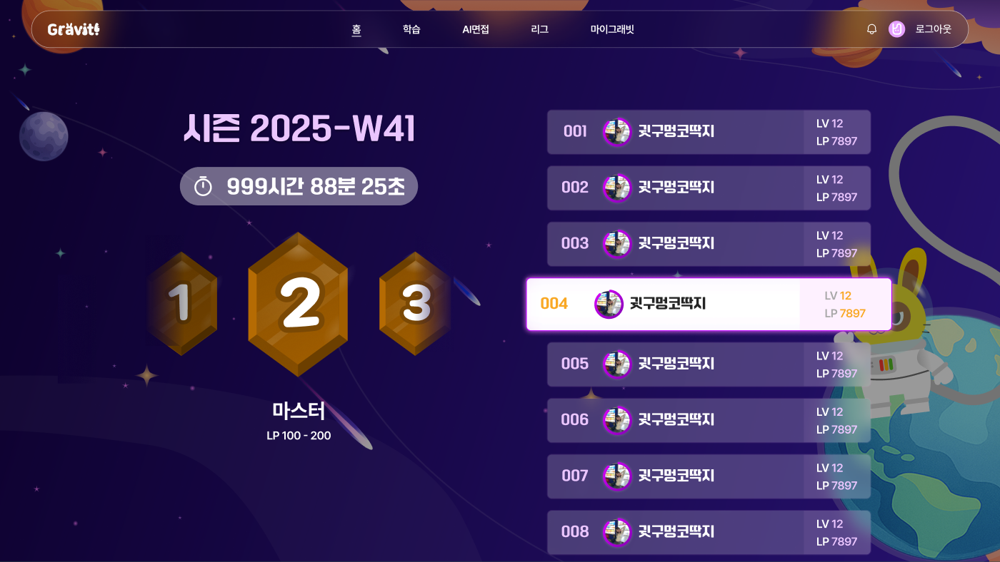
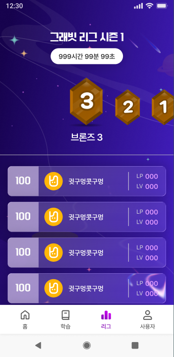

# LG.1 리그 아레나

## 1. 화면 개요

| 항목      | 내용                                                                      |
| --------- | ------------------------------------------------------------------------- |
| 화면 ID   | LG.1                                                                      |
| 화면명    | 리그 아레나                                                               |
| 형태      | 라우트 화면. 우주 배경 위에 시즌 헤더·티어 셀렉터·랭킹 리스트             |
| 경로      | `/league`                                                                 |
| 진입 화면 | 앱 네비게이션(리그 탭) · 인증된 사용자                                    |
| 다음 화면 | 시즌 결과 모달(LG.2) → 시즌 시작 모달(LG.3) — 지난 시즌 팝업 조건 충족 시 |

현재 시즌의 남은 시간, 티어별 랭킹을 보여주는 리그 메인 화면이다. 진입 시 지난 시즌 팝업
조건이 맞으면 결과·시작 모달을 순차로 띄운다.

> 데스크톱(`min-width: 768px`)과 모바일은 배경·레이아웃(2단↔세로)·강조 방식이 다른 별개 시안이다.
> 이 문서는 두 시안을 한 화면으로 다루고, 차이가 있는 곳마다 어느 쪽인지 밝힌다.
> 상단 글로벌 헤더/바텀탭(앱 셸)은 이 화면의 소유가 아니라 `FEAT-026`(앱 셸)의 범위다.

## 2. 근거 자료

- 최신 기능 명세 기준일: 2026년 9월 10일 (`MIG-023` 시안 대조 판정분)
- Figma 화면:
  - [LG-1-web.png](./LG-1-web.png) — WEB [`12356-27331`](https://www.figma.com/design/hu4c6qCEMB62qHXk2v8Gsl/-New-Gravit?node-id=12356-27331) (1920×1080)
  - [LG-1-aos.png](./LG-1-aos.png) — AOS [`12899-41294`](https://www.figma.com/design/hu4c6qCEMB62qHXk2v8Gsl/-New-Gravit?node-id=12899-41294) (360×740)
  - 파일 `hu4c6qCEMB62qHXk2v8Gsl` · 페이지 `2차 에자일`
- 라우트:
  - [`_protected.league.tsx`](../../../apps/web/src/app/routes/_protected.league.tsx) — `/league`
- 화면·위젯:
  - [`league-page.tsx`](../../../apps/web/src/pages/league/ui/league-page.tsx) — 상태 분기·모달 결정
  - [`league-arena.tsx`](../../../apps/web/src/widgets/league-arena/ui/league-arena.tsx) — 시즌 헤더·티어·랭킹 조립
  - [`season-timer.tsx`](../../../apps/web/src/widgets/league-arena/ui/season-timer.tsx) · [`tier-selector.tsx`](../../../apps/web/src/widgets/league-arena/ui/tier-selector.tsx) · [`ranking-list.tsx`](../../../apps/web/src/widgets/league-arena/ui/ranking-list.tsx)
  - [`user-rank-row.tsx`](../../../apps/web/src/entities/league/ui/user-rank-row.tsx) — 랭킹 한 행
- 생성 API 근거:
  - `useEnterHome` — `GET /api/v1/league/home` → `LeagueHomeResponse`
  - `useGetLeague1` — `GET /api/v1/league/{leagueId}` → 티어 정보
  - `useGetMyLeagueWithProfile` — 내 리그 프로필(`leagueId`)
  - `GET /api/v1/ranking/me` · `GET /api/v1/ranking/leagues/{leagueId}/page/{pageNum}` — 랭킹(무한 페이지)

> 기획에서 전달된 기능 명세 표가 없는 화면이다. §3의 기능 ID는 이 문서에서 부여했고,
> 내용의 출처는 Figma 시안과 `MIG-023`의 시안 대조 판정이다.

## 3. 기능 명세

| 구분 | 기능 ID  | 기능명              | 설명                                                                                                  | 참고                   | 우선순위 | 상태 | 완료 | 제외 | 수정일          |
| ---- | -------- | ------------------- | ----------------------------------------------------------------------------------------------------- | ---------------------- | -------- | ---- | ---- | ---- | --------------- |
| 회원 | LG.1-F01 | 상태 분기           | • 프로필/홈 로딩 중 `로딩중`, 에러 시 `에러 발생`, 데이터 없음 시 `데이터 없음` 표시                  |                        | P0       | 완료 | ☑   | ☐    | 2026년 9월 10일 |
| 회원 | LG.1-F02 | 시즌명·타이머       | • 시즌명(`nowSeason`) 표시<br>• 다음 월요일 0시까지 남은 시간을 매초 `HH시간 MM분 SS초`로 갱신        |                        | P0       | 완료 | ☑   | ☐    | 2026년 9월 10일 |
| 회원 | LG.1-F03 | 티어 셀렉터         | • 15티어(브론즈~다이아 ×1/2/3) 가로 스크롤<br>• 선택 티어만 이름·`LP min - max` 표시, 가운데로 스크롤 | 육각 메달 플레이스홀더 | P0       | 완료 | ☑   | ☐    | 2026년 9월 10일 |
| 회원 | LG.1-F04 | 랭킹 조회           | • 선택 티어가 내 티어면 내 랭킹 API, 아니면 티어 랭킹 API로 조회                                      |                        | P0       | 완료 | ☑   | ☐    | 2026년 9월 10일 |
| 회원 | LG.1-F05 | 랭킹 행 표시        | • 순위 3자리(`001`), xp 진행 링 안 프로필, 닉네임, `LV`/`LP`                                          |                        | P0       | 완료 | ☑   | ☐    | 2026년 9월 10일 |
| 회원 | LG.1-F06 | 무한 스크롤         | • 리스트 하단 센티넬 도달 시 다음 페이지 조회<br>• 첫 로딩 300ms 초과 시 스켈레톤 8행                 |                        | P0       | 완료 | ☑   | ☐    | 2026년 9월 10일 |
| 회원 | LG.1-F07 | 빈 랭킹 안내        | • 로딩이 끝났는데 랭킹이 비면 `해당 티어의 첫 주인공을 기다리고 있어요.` 표시                         |                        | P1       | 완료 | ☑   | ☐    | 2026년 9월 10일 |
| 회원 | LG.1-F08 | 지난 시즌 모달 노출 | • `containsPopup && lastSeasonPopupDto`이고 미확인이면 결과(LG.2)→시작(LG.3) 순차 노출                | LG.2 · LG.3            | P0       | 완료 | ☑   | ☐    | 2026년 9월 10일 |
| 회원 | LG.1-F09 | 본인 행 강조        | • 상시 강조 없음. 데스크톱에서 **hover** 시 흰 배경·main 테두리·핑크 글로우로 강조                    | legacy 상시강조 폐기   | P1       | 완료 | ☑   | ☐    | 2026년 9월 10일 |
| 회원 | LG.1-F10 | 반응형              | • Tailwind `md` 기준 모바일(세로)↔데스크톱(좌우 2단) 전환                                            |                        | P0       | 완료 | ☑   | ☐    | 2026년 9월 10일 |

## 4. 라우트 및 화면 이동

| 사용자 동작                      | 이동 경로 / 결과                | 화면        |
| -------------------------------- | ------------------------------- | ----------- |
| 리그 탭 진입                     | (이동 없음)                     | LG.1        |
| 진입 시 지난 시즌 팝업 조건 충족 | 결과 모달 → 시작 모달           | LG.2 → LG.3 |
| 티어 셀렉터에서 다른 티어 선택   | (이동 없음) 해당 티어 랭킹 조회 | LG.1        |
| 랭킹 리스트 하단 도달            | (이동 없음) 다음 페이지 조회    | LG.1        |

```text
/league  (LG.1 리그 아레나)
  ├─ containsPopup && lastSeasonPopupDto && 미확인 → LG.2(결과) → LG.3(시작)
  ├─ 티어 선택 → 해당 티어 랭킹 조회 (화면 유지)
  └─ 하단 스크롤 → 다음 페이지 (화면 유지)
```

## 5. 화면 사용 데이터

**표시·분기에 쓰는 값**

| 화면 용어      | 출처 (API)                                             | 필수 | 용도·제약                                                | 값이 없을 때     |
| -------------- | ------------------------------------------------------ | ---- | -------------------------------------------------------- | ---------------- |
| 시즌명         | `league/home` → `currentSeason.nowSeason`              | 필수 | 상단 시즌 헤더에 그대로 표시                             | `데이터 없음`    |
| 지난 시즌 팝업 | `league/home` → `containsPopup` · `lastSeasonPopupDto` | 아님 | 둘 다 있고 미확인이면 결과·시작 모달 노출                | 모달 표시 안 함  |
| 내 티어 id     | 내 리그 프로필 → `leagueId`                            | 필수 | 티어 셀렉터 초기 선택값·내 티어 랭킹 분기 기준           | `데이터 없음`    |
| 선택 티어 정보 | `league/{leagueId}`                                    | 필수 | 티어 이름·`LP min - max` 표시                            | 티어 정보 미표시 |
| 남은 시간      | 클라이언트 계산(다음 월요일 0시)                       | 필수 | 매초 `HH시간 MM분 SS초` 갱신, 만료 시 `00시간 00분 00초` | —                |

**랭킹 행 데이터** (`LeagueRankRowDto`)

| 화면 용어 | API 필드                  | 용도·제약                     |
| --------- | ------------------------- | ----------------------------- |
| 순위      | `rank`                    | 3자리 zero-pad (`001`)        |
| 프로필    | `profileImgNumber` · `xp` | xp 진행 링 안에 프로필 이미지 |
| 닉네임    | `nickname`                | 말줄임                        |
| 레벨      | `level`                   | `LV` 값                       |
| LP        | `lp`                      | `LP` 값                       |

## 6. Figma 화면

### 데스크톱 (WEB, 1920×1080)



- 우주 배경 위 좌우 2단. 좌측: 시즌명(64px) → 남은 시간 pill → 티어 메달(1/2/3)+`마스터` → `LP min - max`.
- 우측: 랭킹 카드 리스트. 각 행은 순위(`001`)·프로필 링·닉네임 좌블록 + `LV`/`LP` 우블록.
- 본인 행(`004`)은 상시 강조하지 않는다. 강조는 hover에서만 나타난다.

### 모바일 (AOS, 360×740)



- 세로 배치. 상단 헤더(시즌명·흰 pill 타이머·티어 메달) 아래 divider, 그 밑에 랭킹 리스트.
- 랭킹 행은 글래스 카드. 아바타 링 없이(38) 순위·프로필·닉네임 + `LP`/`LV`.

두 시안 모두 로딩·에러 상태 프레임은 없다. 로딩 스켈레톤은 시안에 없어 새로 만들지 않고 공용 관용구를 따랐다.

## 7. 기능별 동작

### LG.1-F01 상태 분기

- 내 리그 프로필 `isFetching` 또는 홈 `isLoading`이면 `로딩중`.
- 둘 중 하나라도 에러면 `에러 발생`. 데이터가 비면 `데이터 없음`.
- 셋 다 아니면 아레나를 렌더한다.

### LG.1-F02 시즌명·타이머

- 시즌명은 `currentSeason.nowSeason` 값을 그대로 표시한다(가공하지 않는다).
- 남은 시간은 다음 월요일 0시를 기준으로 매초 `HH시간 MM분 SS초`로 갱신한다. 만료 시 `00시간 00분 00초`.

### LG.1-F03 티어 셀렉터

- 15티어(브론즈~다이아 ×1/2/3)를 가로 스크롤로 나열한다.
- 선택 티어는 강조하고 이름과 `LP min - max`를 표시한다. 선택 시 해당 버튼을 컨테이너 가운데로 스크롤한다.
- 시안의 육각 메달 배지(3개+`마스터`)는 플레이스홀더다. 티어 셀렉터는 legacy 형식(일러스트 15단계)을 유지한다.

### LG.1-F04 랭킹 조회

- 선택 티어가 내 티어면 내 랭킹 API(`/ranking/me`), 아니면 티어 랭킹 API(`/ranking/leagues/{leagueId}/...`)로 조회한다.
- 두 조회 모두 무한 페이지다.

### LG.1-F05 랭킹 행 표시

- 순위는 3자리 zero-pad(`001`). 프로필은 xp 진행 링 안에 표시한다.
- `LP`와 `LV`를 함께 보여준다. 모바일은 `LP`→`LV`, 데스크톱은 `LV`→`LP` 순으로 배치한다.

### LG.1-F06 무한 스크롤

- 리스트 내부 스크롤 컨테이너 하단의 센티넬이 보이면 다음 페이지를 조회한다(페이지 전체 스크롤이 아니다).
- 첫 페이지 로딩이 300ms를 넘으면 스켈레톤 8행을 띄운다. 그 전에 응답이 오면 스켈레톤 없이 채운다.

### LG.1-F07 빈 랭킹 안내

- 로딩이 끝났는데 랭킹이 비어 있을 때만 `해당 티어의 첫 주인공을 기다리고 있어요.`를 표시한다.
- 로딩 중에는 이 문구를 띄우지 않는다. legacy의 `더 이상 유저가 없습니다.` 하단 문구는 제거했다.

### LG.1-F08 지난 시즌 모달 노출

- `containsPopup`이 참이고 `lastSeasonPopupDto`가 있으며 아직 확인하지 않았으면 모달을 연다.
- 결과 모달(LG.2)을 먼저 보이고, `다음으로`를 누르면 시작 모달(LG.3)을 이어서 보인다. 시작 모달까지 확인하면 흐름이 끝난다.

### LG.1-F09 본인 행 강조

- 본인 행을 상시 강조하지 않는다(legacy의 핑크 테두리·흰 배경 상시 강조는 폐기).
- 데스크톱에서 행에 hover하면 흰 배경·main 테두리·핑크 글로우·확대로 강조한다.

### LG.1-F10 반응형

- Tailwind `md`(`min-width: 768px`) 기준으로 전환한다.
- 데스크톱은 좌우 2단(좌: 시즌/티어, 우: 랭킹), 모바일은 세로 1단(상단 헤더 아래 랭킹)이다.

## 8. 검증 기준

- [x] 프로필/홈이 로딩 중이면 `로딩중`, 에러면 `에러 발생`, 데이터가 없으면 `데이터 없음`이 렌더된다.
- [x] 시즌명이 `currentSeason.nowSeason` 값 그대로 렌더된다.
- [x] 남은 시간이 `HH시간 MM분 SS초` 포맷으로 매초 갱신된다.
- [x] 티어를 선택하면 그 티어의 랭킹을 조회하고, 내 티어일 때와 다른 티어일 때 서로 다른 API를 부른다.
- [x] 랭킹 행의 순위가 3자리 zero-pad(`001`)로 렌더된다.
- [x] 리스트 하단 센티넬이 보이면 다음 페이지 조회가 발생한다.
- [x] 로딩이 끝났고 랭킹이 비면 `해당 티어의 첫 주인공을 기다리고 있어요.`가 렌더된다.
- [x] `containsPopup && lastSeasonPopupDto` 미확인이면 결과 모달 → 시작 모달 순으로 노출된다.

> 체크 상태는 `MIG-023` 검증 시점 기준이다.

## 9. 확인 필요

1. **대기 탭 누락** — legacy에는 월요일 시즌 전환 집계 구간(`00:00~00:04`)에 `시즌 정보를 집계중이에요!`
   대기 탭을 띄우고 본문을 숨기는 동작이 있었고(`MIG-023` 기준선 #3, 판정 "유지"), 현재 이전된
   코드에는 이 분기가 없다. 유지 판정과 구현이 어긋난다 — 재확인이 필요하다.
2. **티어 셀렉터 육각 메달** — 시안의 메달 배지(3개+`마스터`)는 플레이스홀더로 두고 legacy 15단계
   일러스트를 유지했다. 정식 메달 디자인 확정 시 별도 작업으로 교체한다.
3. **시즌명 표기** — 시안의 `2025-W41`은 플레이스홀더다. 실제 표시는 서버 `nowSeason` 값을
   그대로 쓴다. 주차(`Wxx`) 산출을 FE가 해야 하는지는 데이터 출처 확정 전까지 미정이다.
