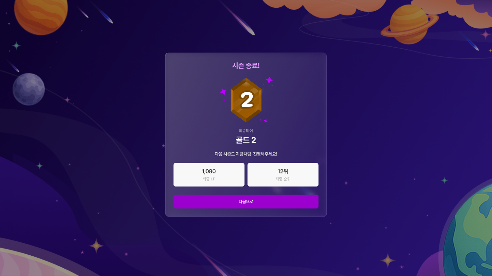
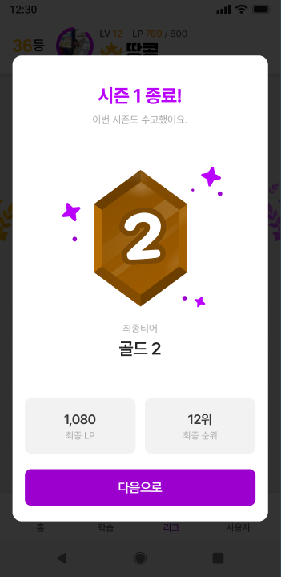

# LG.2 시즌 결과 모달

## 1. 화면 개요

| 항목      | 내용                                                                                     |
| --------- | ---------------------------------------------------------------------------------------- |
| 화면 ID   | LG.2                                                                                     |
| 화면명    | 시즌 결과 모달                                                                           |
| 형태      | `/league` 위 오버레이 모달. 데스크톱=우주 배경 full-screen + 글래스 카드, 모바일=흰 카드 |
| 경로      | `/league` (오버레이)                                                                     |
| 진입 화면 | LG.1 진입 시 지난 시즌 팝업 조건(`containsPopup && lastSeasonPopupDto`) 충족             |
| 다음 화면 | 시즌 시작 모달(LG.3) — `다음으로` 클릭 시                                                |

지난 시즌의 최종 티어·LP·순위를 알리는 모달이다. 배경 클릭·Esc로 닫히지 않고, `다음으로`로만
시작 모달(LG.3)로 넘어간다.

> 데스크톱과 모바일은 표면(글래스↔흰 카드)·배경(우주↔dim)·부제 문구가 다른 별개 시안이다.

## 2. 근거 자료

- 최신 기능 명세 기준일: 2026년 9월 10일 (`MIG-023` 시안 대조 판정분)
- Figma 화면:
  - [LG-2-web.png](./LG-2-web.png) — WEB [`12395-23839`](https://www.figma.com/design/hu4c6qCEMB62qHXk2v8Gsl/-New-Gravit?node-id=12395-23839) (1920×1080)
  - [LG-2-aos.png](./LG-2-aos.png) — AOS [`12899-41553`](https://www.figma.com/design/hu4c6qCEMB62qHXk2v8Gsl/-New-Gravit?node-id=12899-41553) (360×740)
  - 파일 `hu4c6qCEMB62qHXk2v8Gsl` · 페이지 `2차 에자일`
- 구현:
  - [`league-season-modal.tsx`](../../../apps/web/src/widgets/league-season-modal/ui/league-season-modal.tsx) — 결과→시작 순차 흐름
  - [`season-result-modal.tsx`](../../../apps/web/src/widgets/league-season-modal/ui/season-result-modal.tsx)
  - [`modal-tier-badge.tsx`](../../../apps/web/src/widgets/league-season-modal/ui/modal-tier-badge.tsx) · [`modal-stat-box.tsx`](../../../apps/web/src/widgets/league-season-modal/ui/modal-stat-box.tsx)
  - [`modal`](../../../apps/web/src/shared/ui/modal) — 공용 모달(Radix Dialog)
- 생성 API 근거:
  - `GET /api/v1/league/home` → `LastSeasonPopupDto` (`leagueName` · `finalLp` · `rank`)

## 3. 기능 명세

| 구분 | 기능 ID  | 기능명        | 설명                                                                                    | 참고             | 우선순위 | 상태 | 완료 | 제외 | 수정일          |
| ---- | -------- | ------------- | --------------------------------------------------------------------------------------- | ---------------- | -------- | ---- | ---- | ---- | --------------- |
| 회원 | LG.2-F01 | 결과 표시     | • 최종 티어(`leagueName`) + 티어 이미지 • `최종 LP`(`finalLp`)·`최종 순위`(`rank`위) | LG.1-F08         | P0       | 완료 | ☑   | ☐    | 2026년 9월 10일 |
| 회원 | LG.2-F02 | 닫기 차단     | • 배경 클릭·Esc로 닫히지 않는다(`dismissible=false`)                                    |                  | P0       | 완료 | ☑   | ☐    | 2026년 9월 10일 |
| 회원 | LG.2-F03 | 다음으로 이동 | • `다음으로` 클릭 시 시즌 시작 모달(LG.3)로 전환                                        | LG.3             | P0       | 완료 | ☑   | ☐    | 2026년 9월 10일 |
| 회원 | LG.2-F04 | 티어 장식     | • 기존 티어 이미지 + 주위 떠다니는 star(sparkle) 장식                                   | 육각 메달 미적용 | P1       | 완료 | ☑   | ☐    | 2026년 9월 10일 |
| 회원 | LG.2-F05 | 반응형        | • 데스크톱=글래스 카드+우주 배경, 모바일=흰 카드+dim (`md` 기준)                        |                  | P0       | 완료 | ☑   | ☐    | 2026년 9월 10일 |

## 4. 라우트 및 화면 이동

| 사용자 동작     | 이동 경로 / 결과      | 화면 |
| --------------- | --------------------- | ---- |
| `다음으로` 클릭 | 시즌 시작 모달로 전환 | LG.3 |
| 배경 클릭 · Esc | (닫히지 않음)         | LG.2 |

## 5. 화면 사용 데이터

`LastSeasonPopupDto` (from `GET /api/v1/league/home`)

| 화면 용어 | API 필드     | 필수 | 용도·제약                         | 값이 없을 때 |
| --------- | ------------ | ---- | --------------------------------- | ------------ |
| 최종티어  | `leagueName` | 필수 | 티어 이름 + 대응 티어 이미지 선택 | —            |
| 최종 LP   | `finalLp`    | 아님 | `최종 LP` stat 값                 | `0`          |
| 최종 순위 | `rank`       | 아님 | `최종 순위` stat 값(`{rank}위`)   | `0위`        |

## 6. Figma 화면

### 데스크톱 (WEB, 1920×1080)

- 우주 배경 full-screen 위 중앙 글래스 카드. 위에서부터 `시즌 종료!` → 티어 이미지(+star) →
  `최종티어`/티어명 → 부제 → `최종 LP`·`최종 순위` 2칸 stat → `다음으로` 버튼.

### 모바일 (AOS, 360×740)

- dim 배경 위 흰 카드. `시즌 종료!` + 부제 `이번 시즌도 수고했어요.` → 티어 이미지(+star) →
  `최종티어`/티어명 → `최종 LP`·`최종 순위` 2칸 → `다음으로`.

## 7. 기능별 동작

### LG.2-F01 결과 표시

- `leagueName`으로 최종 티어 이름과 대응 티어 이미지를 표시한다.
- stat 2칸: `최종 LP`는 `finalLp`(천단위 구분), `최종 순위`는 `{rank}위`.

### LG.2-F02 닫기 차단

- 모달은 배경 클릭·Esc로 닫히지 않는다. `다음으로`로만 진행한다.

### LG.2-F03 다음으로 이동

- `다음으로`를 누르면 결과 모달을 닫고 시즌 시작 모달(LG.3)을 연다.

### LG.2-F04 티어 장식

- 시안의 육각 메달 대신 기존 티어 이미지를 쓰고, 주위에 떠다니는 star(sparkle) 장식만 더한다.

### LG.2-F05 반응형

- 데스크톱은 글래스 카드 + 우주 배경, 모바일은 흰 카드 + dim 배경. `md` 기준으로 전환한다.

## 8. 검증 기준

- [x] `containsPopup && lastSeasonPopupDto` 미확인 상태로 `/league`에 진입하면 결과 모달이 먼저 렌더된다.
- [x] 최종 티어 이름이 `leagueName`으로 렌더된다.
- [x] `최종 LP`가 `finalLp`, `최종 순위`가 `{rank}위`로 렌더된다.
- [x] 배경 클릭·Esc로 모달이 닫히지 않는다.
- [x] `다음으로`를 누르면 결과 모달이 닫히고 시작 모달이 렌더된다.

> 체크 상태는 `MIG-023` 검증 시점 기준이다.

## 9. 확인 필요

1. **부제 문구 불일치** — `MIG-023`은 "모달 부제를 모바일 시안 기준으로 통일"(`이번 시즌도 수고했어요.`)
   로 판정했으나, 데스크톱 구현은 `다음 시즌도 지금처럼 진행해주세요!`로 남아 있다. 통일 대상과
   실제 표기가 어긋난다 — 확정이 필요하다.
2. **최종 LP 출처** — `finalLp`는 서버 필드로 확정되어 실데이터를 쓴다(과거 임시 하드코딩 제거 완료).
   값이 없을 때 `0` 폴백을 유지할지 확인이 필요하다.
