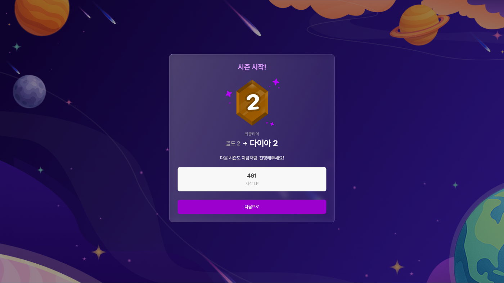
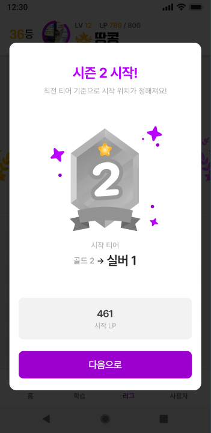

# LG.3 시즌 시작 모달

## 1. 화면 개요

| 항목      | 내용                                                                                     |
| --------- | ---------------------------------------------------------------------------------------- |
| 화면 ID   | LG.3                                                                                     |
| 화면명    | 시즌 시작 모달                                                                           |
| 형태      | `/league` 위 오버레이 모달. 데스크톱=우주 배경 full-screen + 글래스 카드, 모바일=흰 카드 |
| 경로      | `/league` (오버레이)                                                                     |
| 진입 화면 | 시즌 결과 모달(LG.2)에서 `다음으로` 클릭                                                 |
| 다음 화면 | 없음 — `다음으로` 클릭 시 흐름 종료(모달 닫힘, 확인 처리)                                |

새 시즌의 시작 티어와 시작 LP를 알리는 모달이다. 결과 모달(LG.2) 다음에 이어서 노출되며,
`다음으로`로 닫으면 이번 진입의 지난 시즌 팝업 흐름이 끝난다.

> 데스크톱과 모바일은 표면(글래스↔흰 카드)·배경(우주↔dim)·부제 문구가 다른 별개 시안이다.

## 2. 근거 자료

- 최신 기능 명세 기준일: 2026년 9월 10일 (`MIG-023` 시안 대조 판정분)
- Figma 화면:
  - [LG-3-web.png](./LG-3-web.png) — WEB [`12933-25548`](https://www.figma.com/design/hu4c6qCEMB62qHXk2v8Gsl/-New-Gravit?node-id=12933-25548) (1920×1080)
  - [LG-3-aos.png](./LG-3-aos.png) — AOS [`12899-41991`](https://www.figma.com/design/hu4c6qCEMB62qHXk2v8Gsl/-New-Gravit?node-id=12899-41991) (360×740)
  - 파일 `hu4c6qCEMB62qHXk2v8Gsl` · 페이지 `2차 에자일`
- 구현:
  - [`league-season-modal.tsx`](../../../apps/web/src/widgets/league-season-modal/ui/league-season-modal.tsx) — 결과→시작 순차 흐름
  - [`season-start-modal.tsx`](../../../apps/web/src/widgets/league-season-modal/ui/season-start-modal.tsx)
  - [`modal-tier-badge.tsx`](../../../apps/web/src/widgets/league-season-modal/ui/modal-tier-badge.tsx) · [`modal-stat-box.tsx`](../../../apps/web/src/widgets/league-season-modal/ui/modal-stat-box.tsx)
- 생성 API 근거:
  - `GET /api/v1/league/home` → `LastSeasonPopupDto` (`leagueName` · `nextLeagueName` · `nextStartLp`)

## 3. 기능 명세

| 구분 | 기능 ID  | 기능명         | 설명                                                                   | 참고             | 우선순위 | 상태 | 완료 | 제외 | 수정일          |
| ---- | -------- | -------------- | ---------------------------------------------------------------------- | ---------------- | -------- | ---- | ---- | ---- | --------------- |
| 회원 | LG.3-F01 | 시작 티어 표시 | • 이전 티어(`leagueName`) → 새 티어(`nextLeagueName`) + 새 티어 이미지 | LG.2             | P0       | 완료 | ☑   | ☐    | 2026년 9월 10일 |
| 회원 | LG.3-F02 | 시작 LP 표시   | • `시작 LP`(`nextStartLp`) 1칸 stat                                    |                  | P0       | 완료 | ☑   | ☐    | 2026년 9월 10일 |
| 회원 | LG.3-F03 | 닫기 차단      | • 배경 클릭·Esc로 닫히지 않는다(`dismissible=false`)                   |                  | P0       | 완료 | ☑   | ☐    | 2026년 9월 10일 |
| 회원 | LG.3-F04 | 흐름 종료      | • `다음으로` 클릭 시 모달을 닫고 이번 진입의 팝업 흐름을 확인 처리한다 | LG.1-F08         | P0       | 완료 | ☑   | ☐    | 2026년 9월 10일 |
| 회원 | LG.3-F05 | 티어 장식      | • 기존 티어 이미지 + 주위 떠다니는 star(sparkle) 장식                  | 육각 메달 미적용 | P1       | 완료 | ☑   | ☐    | 2026년 9월 10일 |
| 회원 | LG.3-F06 | 반응형         | • 데스크톱=글래스 카드+우주 배경, 모바일=흰 카드+dim (`md` 기준)       |                  | P0       | 완료 | ☑   | ☐    | 2026년 9월 10일 |

## 4. 라우트 및 화면 이동

| 사용자 동작     | 이동 경로 / 결과               | 화면 |
| --------------- | ------------------------------ | ---- |
| `다음으로` 클릭 | 모달 닫힘, 팝업 흐름 확인 처리 | LG.1 |
| 배경 클릭 · Esc | (닫히지 않음)                  | LG.3 |

## 5. 화면 사용 데이터

`LastSeasonPopupDto` (from `GET /api/v1/league/home`)

| 화면 용어 | API 필드         | 필수 | 용도·제약                         | 값이 없을 때 |
| --------- | ---------------- | ---- | --------------------------------- | ------------ |
| 이전 티어 | `leagueName`     | 필수 | `이전 티어 → 새 티어` 좌측 표기   | —            |
| 새 티어   | `nextLeagueName` | 필수 | 우측 표기 + 대응 티어 이미지 선택 | —            |
| 시작 LP   | `nextStartLp`    | 아님 | `시작 LP` stat 값                 | `0`          |

## 6. Figma 화면

### 데스크톱 (WEB, 1920×1080)

- 우주 배경 full-screen 위 중앙 글래스 카드. `시즌 시작!` → 새 티어 이미지(+star) →
  `시작 티어`/`이전 티어 → 새 티어` → 부제 → `시작 LP` 1칸 stat → `다음으로` 버튼.

### 모바일 (AOS, 360×740)

- dim 배경 위 흰 카드. `시즌 시작!` + 부제 `직전 티어 기준으로 시작 위치가 정해져요!` →
  새 티어 이미지(+star) → `시작 티어`/`이전 티어 → 새 티어` → `시작 LP` → `다음으로`.

## 7. 기능별 동작

### LG.3-F01 시작 티어 표시

- `leagueName`(이전 티어)와 `nextLeagueName`(새 티어)을 `이전 → 새` 형태로 표시한다.
- 새 티어 이미지는 `nextLeagueName`으로 선택한다.

### LG.3-F02 시작 LP 표시

- `시작 LP` stat에 `nextStartLp` 값을 표시한다.

### LG.3-F03 닫기 차단

- 모달은 배경 클릭·Esc로 닫히지 않는다. `다음으로`로만 종료한다.

### LG.3-F04 흐름 종료

- `다음으로`를 누르면 모달을 닫고 이번 진입의 지난 시즌 팝업 흐름을 확인 처리한다(재노출하지 않는다).

### LG.3-F05 티어 장식

- 육각 메달 대신 기존 티어 이미지 + 떠다니는 star(sparkle) 장식을 쓴다.

### LG.3-F06 반응형

- 데스크톱=글래스 카드+우주 배경, 모바일=흰 카드+dim. `md` 기준으로 전환한다.

## 8. 검증 기준

- [x] 결과 모달에서 `다음으로`를 누르면 시작 모달이 렌더된다.
- [x] `이전 티어 → 새 티어`가 `leagueName` → `nextLeagueName`으로 렌더된다.
- [x] `시작 LP`가 `nextStartLp`로 렌더된다.
- [x] 배경 클릭·Esc로 모달이 닫히지 않는다.
- [x] `다음으로`를 누르면 모달이 닫히고 다시 노출되지 않는다.

> 체크 상태는 `MIG-023` 검증 시점 기준이다.

## 9. 확인 필요

1. **부제 문구 불일치** — `MIG-023`은 "모달 부제를 모바일 시안 기준으로 통일"(`직전 티어 기준으로
시작 위치가 정해져요!`)로 판정했으나, 데스크톱 구현은 `다음 시즌도 지금처럼 진행해주세요!`로
   남아 있다. LG.2와 동일한 불일치로, 함께 확정이 필요하다.
