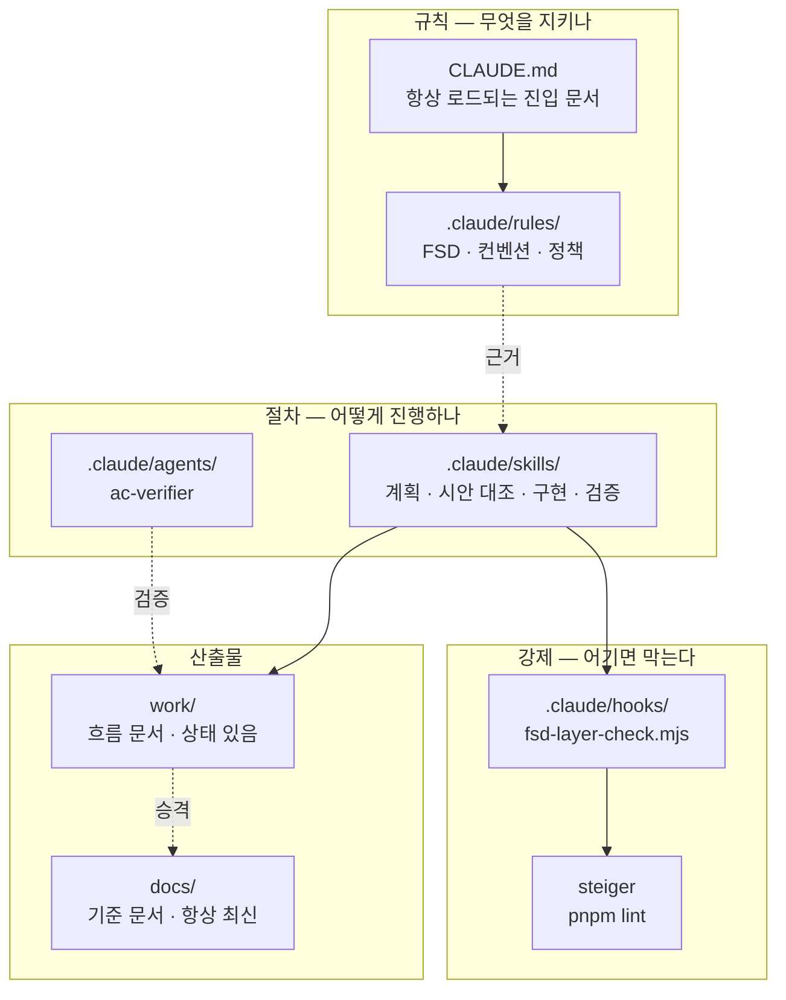
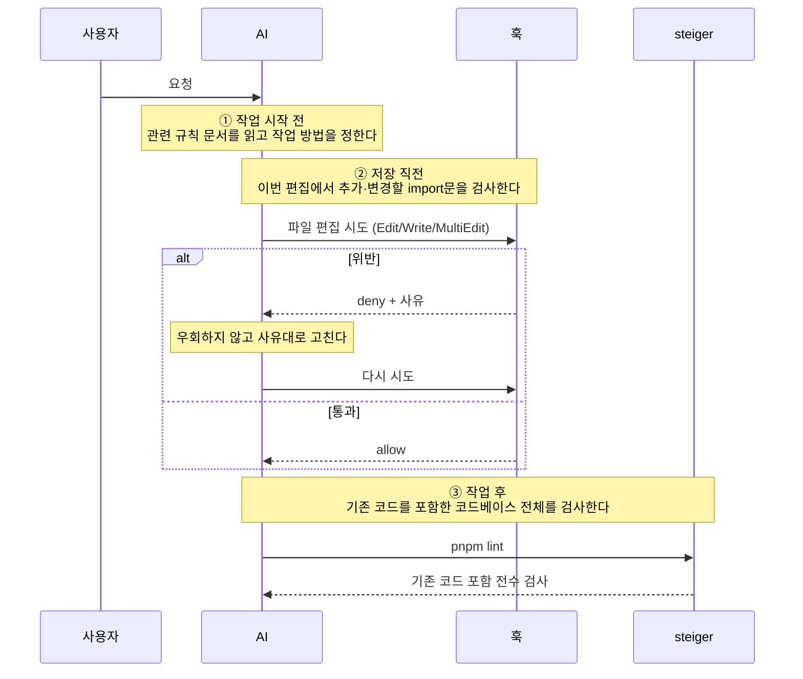
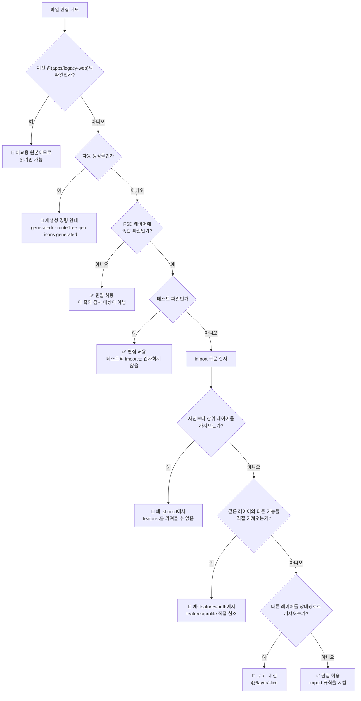
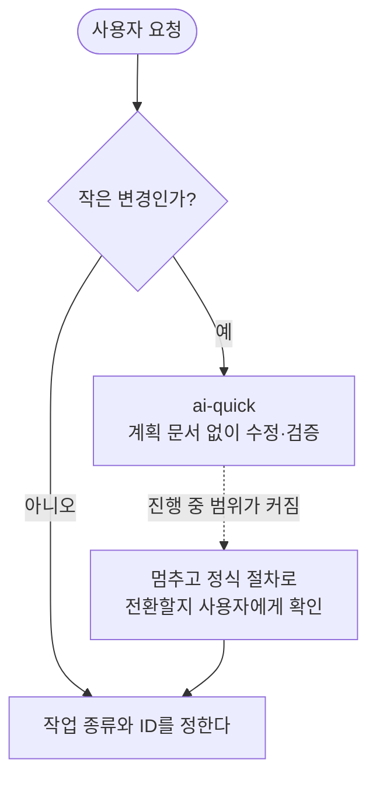
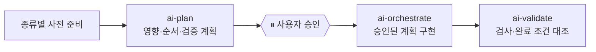
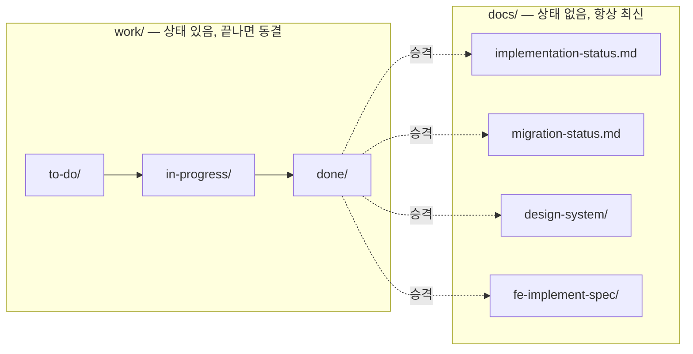

# AI 하네스 가이드

**AI와 함께 작업하기 위한 장치가 무엇이고, 언제 어떻게 작동하는가.**

> 이 문서는 **구조와 흐름**만 다룬다. 규칙 내용 자체는 `CLAUDE.md`와 `.claude/rules/`에 있고
> 여기서 다시 쓰지 않는다 — 같은 규칙을 두 곳에 적으면 반드시 한쪽이 낡는다.
> "무엇을 지켜야 하나"는 규칙 파일을, **"이게 언제 작동하나"는 이 문서**를 본다.

---

## 1. 왜 필요한가

규칙이 사람 머릿속에만 있으면 매번 다시 설명해야 하고, AI는 없는 명령어나 없는 경로를 지어낸다.
그래서 **규칙을 파일로 고정**하고, 지켜지지 않으면 **편집 시점에 차단**한다.

## 2. 전체 지도



| 위치              | 역할                                                             |
| ----------------- | ---------------------------------------------------------------- |
| `CLAUDE.md`       | 프로젝트 헌법. 세션마다 자동으로 읽힌다                          |
| `.claude/rules/`  | FSD·코드·작업 정책의 상세 규칙                                   |
| `.claude/skills/` | 작업 절차. 사용자가 부르거나 AI가 판단해 탄다                    |
| `.claude/agents/` | 서브에이전트. 현재 `ac-verifier`(검증 기준 독립 확인, 읽기 전용) |
| `.claude/hooks/`  | 편집 직전 차단 장치                                              |
| `work/`           | 진행 중인 작업 문서                                              |
| `docs/`           | 확정된 기준 문서                                                 |

`AGENTS.md`(Codex)와 `.codex/`도 **같은 `.claude/` 파일을 가리킨다.** 사본을 만들지 않는다.

## 3. 규칙은 언제 확인되는가

규칙은 다음 세 시점에 확인된다. 같은 검사를 세 번 반복하는 것이 아니라, 각 단계가 확인하는
대상과 목적이 다르다.

| 시점                 | 무엇이 일어나는가                                     | 확인 범위                          |
| -------------------- | ----------------------------------------------------- | ---------------------------------- |
| ① 작업을 시작할 때   | AI가 규칙 문서를 읽고 올바른 작업 방법을 선택한다     | 작업에 필요한 안내와 판단          |
| ② 파일을 편집하기 전 | 훅이 이번 편집 내용을 검사하고 위반이면 편집을 막는다 | 이번에 추가하거나 변경할 import문  |
| ③ 작업을 마칠 때     | `pnpm lint`가 저장소를 검사한다                       | 기존 코드를 포함한 코드베이스 전체 |

여기서 **훅(hook)**은 AI가 파일을 바꾸기 직전에 자동으로 실행되는 검사 프로그램이다. 개발자가
별도로 명령을 입력하지 않아도 실행되며, 문제가 있으면 파일 변경 자체를 허용하지 않는다.
**Steiger**는 작업이 끝난 뒤 전체 코드에서 FSD 구조 위반을 찾는 검사 도구이며, `pnpm lint`에
포함되어 실행된다.



예를 들어 기존 파일에 잘못된 import문이 있어도, 이번 편집에서 그 줄을 건드리지 않았다면 훅은
그 문제를 발견하지 못할 수 있다. 작업 마지막에 실행하는 `pnpm lint`가 이런 기존 문제까지 포함해
전체 파일을 검사한다.

## 4. 훅은 무엇을 막나

`PreToolUse` 이벤트로 `Edit`·`Write`·`MultiEdit` **직전에** 실행된다.

먼저 이 저장소의 두 웹 앱을 구분해야 한다.

| 경로               | 의미                                                      | AI 편집 가능 여부 |
| ------------------ | --------------------------------------------------------- | ----------------- |
| `apps/legacy-web/` | 이전 버전 웹 앱. 새 앱으로 옮길 동작과 UI를 확인하는 원본 | 불가, 읽기만 가능 |
| `apps/web/`        | 현재 개발하는 새 웹 앱                                    | 가능              |

따라서 아래 그림의 첫 질문인 “`apps/legacy-web/`인가?”는 **AI가 바꾸려는 파일이 이전 버전 앱
안에 있는지 확인한다**는 뜻이다. 이전 코드는 마이그레이션의 비교 기준이므로 직접 고치지 않는다.



`apps/web/src`는 아래 순서로 레이어가 올라간다. 왼쪽 레이어는 오른쪽 레이어를 가져올 수 없고,
오른쪽 레이어는 왼쪽 레이어를 가져올 수 있다.

```
shared(0) → entities(1) → features(2) → widgets(3) → pages(4) → app(5)
```

여기서 “이번 편집에서 추가하거나 변경할 import문”은 다음 세 형태를 모두 뜻한다.

```ts
import { Button } from '@/shared/ui/button'; // 일반 import
const page = import('@/pages/home'); // 동적 import()
const module = require('./module'); // require()
```

훅은 이 구문들이 FSD 레이어 방향, 같은 레이어의 기능 간 경계, 절대경로 사용 규칙을 지키는지
검사한다. 차단되면 무엇이 잘못됐는지와 고치는 방법이 함께 표시된다.

## 5. 작업 종류에 따라 절차가 갈린다

모든 요청에 계획 문서를 만드는 것은 아니다. 먼저 `ai-quick`으로 끝낼 수 있는 작은 변경인지
확인하고, 정식 절차가 필요할 때 작업 종류와 ID를 정한다.



다음 중 하나라도 해당하면 작은 변경이 아니다.

- 변경 파일이 5개를 넘을 것으로 예상된다
- 여러 slice에 영향을 주거나 새 slice를 만들어야 한다
- `apps/legacy-web`의 코드를 `apps/web`으로 이전한다
- Figma 시안과 구현을 대조해야 한다
- 인증·라우트 트리·API 생성 코드처럼 영향 범위가 큰 구조가 얽힌다
- 동작 변경과 구조 변경이 함께 들어간다

작업을 시작한 뒤 이런 조건이 드러나도 AI가 임의로 계속하지 않는다. 지금까지 변경한 내용을
알리고, 정식 절차로 전환할지 사용자에게 묻는다.

### 작업 종류별 시작점

| prefix   | 언제 쓰나                                   | 먼저 하는 일                                                         |
| -------- | ------------------------------------------- | -------------------------------------------------------------------- |
| `FEAT-`  | 기존에 없던 웹 기능을 만든다                | `feature-planner`로 요구사항과 이슈를 만들고 `issue-reviewer`로 검토 |
| `MIG-`   | `legacy-web`의 기능을 `apps/web`으로 옮긴다 | `refactor-baseline`으로 기존 동작을 기록한 뒤 `design-diff` 수행     |
| `REF-`   | 동작은 유지하고 `apps/web`의 구조만 바꾼다  | 작은 범위는 `ai-plan`, 큰 범위는 `refactor-planner`로 먼저 분해      |
| `FIX-`   | 버그를 고치거나 확정된 시안 차이를 반영한다 | 버그는 재현부터, 시안 문제는 `design-diff`의 사용자 판정부터         |
| `NAT-`   | `apps/native`에 기존에 없던 기능을 만든다   | 관련 `expo:*` 지침을 적용하고 신규 기능 기획 절차 수행               |
| `INFRA-` | 하네스·빌드·CI 같은 개발 환경을 변경한다    | 범위에 따라 `ai-quick` 또는 `ai-plan`                                |

`MIG-`에서 `design-diff`는 구현과 시안의 차이를 찾지만 **그 자리에서 코드를 고치지 않는다.**
시안에 없는 요소도 사용자 경로에 필요할 수 있고, 구현과 시안 중 어느 쪽이 최신인지 AI가 알 수 없기
때문이다. 차이를 표로 만든 뒤 사용자가 `고침 / 유지 / 나중`으로 판정해야 다음 단계로 간다.

이전 중 새 동작이 필요하다는 사실을 발견하면 출처를 먼저 구분한다. legacy에 이미 있는 동작이면
`MIG-`의 기준선과 AC에 포함해 보존한다. legacy에 없지만 제품에 필요한 동작이면 `FEAT-` 또는
`FIX-`로 분리하고 별도 AC와 테스트를 둔다. 라우트·FSD 구조 정리는 MIG 계획에 포함할 수 있지만,
접근 조건·문구·에러 처리 같은 동작을 “옮기는 김에” 바꾸지는 않는다.

### 정식 작업의 공통 흐름

종류별 사전 준비가 끝나면 아래 구현·검증 흐름으로 모인다.



규모가 큰 `FEAT-`·`NAT-`·`MIG-`·`REF-` 작업은 종류별 planner로 여러 개의 실행 가능한 이슈로
나눌 수 있다. 실행 이슈 하나는 GitHub Issue 하나와 1:1로 연결하지만, `plan.md`와
`checklist.md`는 work task 전체의 구현 순서와 완료 여부를 관리한다. 의존성은 무조건 직렬로
만들지 않고 실제 선행 관계만 DAG로 기록한다.

**⏸ 게이트**는 중요한 판단을 사용자에게 제시하고 답을 받을 때까지 멈추는 지점이다. 그림에는
공통 구현 승인만 표시했지만, 실제로는 다음 단계 안에도 게이트가 있다.

- `feature-planner`: 요구사항·기술 결정·이슈 분해 과정에서 3회
- `refactor-planner`: 기준선·구조 결정·이전 매핑·이슈 분해 과정에서 4회
- `design-diff`: 발견한 차이를 `고침 / 유지 / 나중`으로 판정할 때
- `ai-plan`: 코드 구현을 시작해도 되는지 최종 승인할 때

사용자 답변 없이 게이트를 넘어가거나, `design-diff`에서 발견한 차이를 AI가 임의로 고치지
않는다. 이 정지 지점들이 하네스의 핵심 안전장치다.

> 아직 만들지 않은 것: `ai-deliver` · `ai-retrospect` · TDD 3종.
> **겪어보지 않은 절차는 미리 만들지 않는다** — 없는 걸 지시하면 AI가 찾다가 지어낸다.

## 6. 문서는 어디서 어디로 흐르나

`work/`는 작업이 진행되는 과정을 기록하고, `docs/`는 작업 결과 중 다음 작업에서도 계속 알아야
할 확정 사실을 기록한다. 작업 폴더 전체를 `docs/`로 옮기는 것이 아니라, 완료된 작업에서 확정된
내용만 관련 기준 문서에 반영한다. 이 반영을 여기서는 **승격**이라고 부른다.



- 폴더가 **통째로** 이동한다. `git mv`를 쓰면 이력이 유지된다
- **`in-progress/`에는 하나만 둔다** — 스킬이 `ls work/in-progress/`로 "지금 하는 일"을 읽는다
- `done/`으로 간 작업 폴더는 더 이상 수정하지 않는다. 후속 변경은 새 작업 ID로 시작한다
- 작업이 끝나면 **확정된 내용만 해당하는 `docs/` 문서로 승격**한다. 모든 작업이 세 문서를 전부
  수정하는 것은 아니다

| 완료된 작업에서 확정된 것      | 반영할 기준 문서                  |
| ------------------------------ | --------------------------------- |
| 화면의 플랫폼별 구현·검증 상태 | `docs/implementation-status.md`   |
| `MIG-` 작업의 legacy 대체 상태 | `docs/migration-status.md`        |
| 화면의 확정 명세와 검증 기준   | `docs/fe-implement-spec/`         |
| 새로 정한 토큰·컴포넌트 규격   | `docs/design-system/`             |
| 새로 합의한 코드 작성 규칙     | `.claude/rules/`의 관련 규칙 파일 |

예를 들어 화면 이전과 함께 Footer 색상 토큰을 확정했다면, 화면 구현 상태는
`implementation-status.md`, legacy 대체 상태는 `migration-status.md`, 토큰 결정은
`design-system/`에 각각 반영한다.

#### 예외: 작업 중 기준 문서 즉시 동기화

`design-diff`가 여러 작업에 공통으로 영향을 주는 토큰 상태나 Figma 링크를 발견하면 작업 도중에도
`docs/design-system/`을 갱신할 수 있다. 이것은 완료된 작업의 **승격이 아니라**, 모두가 공유해야 할
현재 상태를 즉시 맞추는 **동기화**다. `work/`의 상태 이동과는 다른 흐름이므로 위 다이어그램에는
표시하지 않는다.

## 7. 검증 명령

현재 전체 검증을 묶은 스크립트는 없다. 정식 작업을 마칠 때는 다음 검사를 실행한다.

```bash
pnpm lint          # eslint + steiger(FSD 경계)
pnpm check-types
pnpm test
pnpm build
```

포맷은 현재 저장소 전체가 아니라 이번에 변경한 파일을 검사한다. 커밋된 기존 파일 6개가 포맷
검사에 실패하는 상태이기 때문이다(`REF-003`). 이 문제가 해결되면 `pnpm format:check`도 전체
검증에 포함한다.

```bash
pnpm exec prettier --check <이번에 변경한 파일>
```

### 묶음 명령은 언제 만드나

전체 검증 묶음 명령과 커밋·PR 자동 검사는 아직 없다. 현재 `.github/workflows/`에는 Storybook
배포만 있다. 도입 계획은 `work/to-do/INFRA-010-검증-자동화/`에서 관리하고, 현재 동작의 상세는
`.claude/rules/git-workflow.md`에서 확인한다.

## 8. 더 읽을 것

| 알고 싶은 것                | 문서                                                  |
| --------------------------- | ----------------------------------------------------- |
| 프로젝트 전반·함정 목록     | `CLAUDE.md`                                           |
| FSD 레이어별 규칙           | `.claude/rules/fsd-*.md`                              |
| 구조 변경을 시작해도 되는가 | `.claude/rules/refactor-checklist.md`                 |
| 무엇에 테스트를 쓰나        | `.claude/rules/test-policy.md`                        |
| 브랜치·머지·CI              | `.claude/rules/git-workflow.md`                       |
| 작업 폴더 운용              | `.claude/rules/work-management.md` · `work/README.md` |
| 디자인 토큰 상태            | `docs/design-system/README.md`                        |
| 화면 명세 규격·화면 ID      | `docs/fe-implement-spec/README.md`                    |
